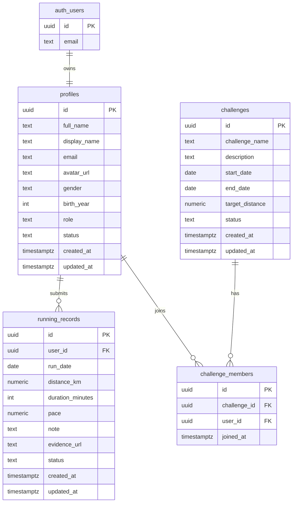

# Phase 2 - Database Design

## Overview

The database is designed for Supabase PostgreSQL with Row Level Security enabled on all application tables.

Core tables:

- `profiles`
- `running_records`
- `challenges`
- `challenge_members`

Recommended supporting objects:

- Dashboard views or RPC functions.
- Leaderboard views or RPC functions.
- Storage bucket named `running-evidence`.

## Entity Relationship Diagram



## Table: profiles

Purpose:

Stores public and application-specific user profile data. Authentication credentials remain in Supabase Auth, not in this table.

Columns:

| Column | Type | Rule |
|---|---|---|
| `id` | `uuid` | Primary key, references `auth.users(id)` |
| `full_name` | `text` | Optional |
| `display_name` | `text` | Required for leaderboard display |
| `email` | `text` | Required, copied from Auth for display/search |
| `avatar_url` | `text` | Optional |
| `gender` | `text` | Optional |
| `birth_year` | `int` | Optional |
| `role` | `text` | `member` or `admin` |
| `status` | `text` | `active` or `inactive` |
| `created_at` | `timestamptz` | Default now |
| `updated_at` | `timestamptz` | Default now |

Constraints:

- `role in ('member', 'admin')`
- `status in ('active', 'inactive')`
- `birth_year` should be reasonable if present.
- `display_name` should not be empty.

Indexes:

- `profiles_role_idx` on `role`
- `profiles_status_idx` on `status`
- `profiles_display_name_idx` on `display_name`

## Table: running_records

Purpose:

Stores running submissions from members.

Columns:

| Column | Type | Rule |
|---|---|---|
| `id` | `uuid` | Primary key |
| `user_id` | `uuid` | References `profiles(id)` |
| `run_date` | `date` | Required, must not be future date |
| `distance_km` | `numeric(8,2)` | Required, greater than 0 |
| `duration_minutes` | `int` | Required, greater than 0 |
| `pace` | `numeric(8,2)` | Generated or calculated as minutes per km |
| `note` | `text` | Optional |
| `evidence_url` | `text` | Optional but recommended |
| `status` | `text` | `pending`, `approved`, or `rejected` |
| `created_at` | `timestamptz` | Default now |
| `updated_at` | `timestamptz` | Default now |

Constraints:

- `distance_km > 0`
- `duration_minutes > 0`
- `run_date <= current_date`
- `status in ('pending', 'approved', 'rejected')`
- `pace = duration_minutes / distance_km`

Indexes:

- `running_records_user_id_idx` on `user_id`
- `running_records_run_date_idx` on `run_date`
- `running_records_status_idx` on `status`
- Composite index on `(status, run_date)`
- Composite index on `(user_id, run_date)`

## Table: challenges

Purpose:

Stores running challenges created by admins.

Columns:

| Column | Type | Rule |
|---|---|---|
| `id` | `uuid` | Primary key |
| `challenge_name` | `text` | Required |
| `description` | `text` | Optional |
| `start_date` | `date` | Required |
| `end_date` | `date` | Required |
| `target_distance` | `numeric(8,2)` | Required, greater than 0 |
| `status` | `text` | `draft`, `active`, `completed`, `cancelled` |
| `created_at` | `timestamptz` | Default now |
| `updated_at` | `timestamptz` | Default now |

Constraints:

- `end_date >= start_date`
- `target_distance > 0`
- `status in ('draft', 'active', 'completed', 'cancelled')`

Indexes:

- `challenges_status_idx` on `status`
- `challenges_date_range_idx` on `(start_date, end_date)`

## Table: challenge_members

Purpose:

Stores members who joined each challenge.

Columns:

| Column | Type | Rule |
|---|---|---|
| `id` | `uuid` | Primary key |
| `challenge_id` | `uuid` | References `challenges(id)` |
| `user_id` | `uuid` | References `profiles(id)` |
| `joined_at` | `timestamptz` | Default now |

Constraints:

- Unique `(challenge_id, user_id)` to prevent duplicate joins.

Indexes:

- `challenge_members_challenge_id_idx` on `challenge_id`
- `challenge_members_user_id_idx` on `user_id`
- Unique index on `(challenge_id, user_id)`

## Recommended Views / RPC

### 1. Member Dashboard Summary

Purpose:

Return one row for the logged-in user:

- today distance
- week distance
- month distance
- all-time distance
- total runs
- average pace
- current all-time rank

Recommended as RPC:

```text
get_member_dashboard_summary(user_id uuid)
```

The function should rely on `auth.uid()` or secure RLS, not a trusted frontend role.

### 2. Leaderboard

Purpose:

Aggregate approved records by range.

Recommended RPC:

```text
get_leaderboard(range text)
```

Supported range values:

- `today`
- `week`
- `month`
- `all`

Returned fields:

- rank
- user_id
- display_name
- avatar_url
- total_runs
- total_distance
- average_pace

### 3. Challenge Progress

Purpose:

Calculate member progress in each challenge using approved running records that fall within the challenge date range.

Recommended RPC:

```text
get_challenge_progress(challenge_id uuid)
```

Returned fields:

- user_id
- display_name
- total_distance
- target_distance
- progress_percent

## Storage Design

Bucket:

```text
running-evidence
```

Path convention:

```text
{user_id}/{record_id}/evidence.{ext}
```

Accepted files:

- JPG
- PNG
- WebP

Suggested max size:

```text
5 MB
```

## RLS Planning Notes

RLS policies will be implemented in Phase 4, but the database design must support them.

Required policy boundaries:

- Members can select their own profile and public leaderboard profile fields.
- Members can update their own profile except `role` and `status`.
- Members can insert own running records with `status = pending`.
- Members can update/delete own pending or rejected records, depending on final rule.
- Members cannot approve their own records.
- Admins can read and manage all profiles and records.
- Admins can create and manage challenges.

## Relationship Summary

- `profiles.id` maps one-to-one to `auth.users.id`.
- One profile has many running records.
- One challenge has many challenge members.
- One profile can join many challenges.
- Approved running records are used for leaderboard and challenge totals.

## Phase 2 Deliverables

- Core entities defined.
- Columns, constraints, and indexes planned.
- ER diagram documented.
- Aggregation strategy documented.
- Storage structure documented.

## Test Checklist

- Confirm each table has a primary key.
- Confirm all cross-table relationships have foreign keys.
- Confirm leaderboard queries can use indexes on `status` and `run_date`.
- Confirm member history can use indexes on `user_id` and `run_date`.
- Confirm challenge membership prevents duplicate joins.
- Confirm no password or secret credential is stored in application tables.
